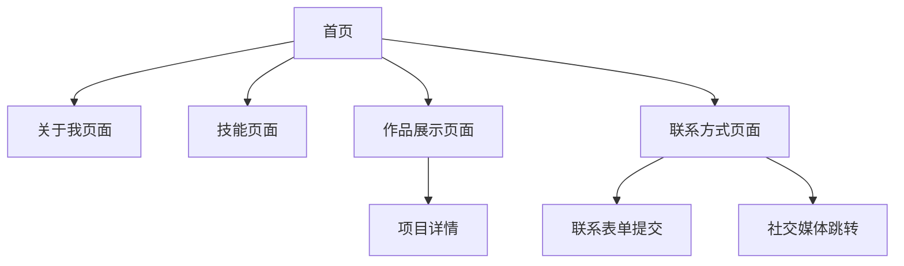

## 1. Product Overview
Aoki的个人作品集网站，展示个人技能、项目作品和联系方式的专业平台。帮助访客快速了解Aoki的专业能力和工作经历，建立个人品牌形象。

## 2. Core Features

### 2.1 User Roles
本网站为个人展示型网站，无需用户注册登录功能，所有访客均可浏览全部内容。

### 2.2 Feature Module
个人作品集网站包含以下核心页面：
1. **首页**：个人简介、核心技能展示、最新作品预览
2. **关于我页面**：详细介绍、教育背景、工作经历
3. **技能页面**：技术栈展示、技能熟练度可视化
4. **作品展示页面**：项目列表、项目详情、技术栈标签
5. **联系方式页面**：联系表单、社交媒体链接

### 2.3 Page Details
| Page Name | Module Name | Feature description |
|-----------|-------------|---------------------|
| 首页 | Hero区域 | 展示个人头像、姓名、职位标语、滚动技能关键词 |
| 首页 | 技能概览 | 展示核心技能图标和简要描述 |
| 首页 | 精选作品 | 展示3-4个代表性项目的卡片预览 |
| 关于我页面 | 个人简介 | 详细介绍个人背景、职业经历、职业目标 |
| 关于我页面 | 教育经历 | 展示学历信息、专业、毕业时间 |
| 关于我页面 | 工作经历 | 展示公司logo、职位、工作时间、主要职责 |
| 技能页面 | 技术分类 | 按前端、后端、工具等分类展示技能 |
| 技能页面 | 熟练度展示 | 使用进度条或星级系统展示技能水平 |
| 作品展示页面 | 项目筛选 | 按技术栈、项目类型进行筛选 |
| 作品展示页面 | 项目卡片 | 展示项目缩略图、标题、简介、技术标签 |
| 作品展示页面 | 项目详情 | 点击卡片展开详情模态框，包含项目描述、技术栈、链接 |
| 联系方式页面 | 联系表单 | 姓名、邮箱、主题、消息内容的表单提交 |
| 联系方式页面 | 社交链接 | GitHub、LinkedIn、邮箱等图标链接 |

## 3. Core Process
访客访问网站的主要流程：
1. 访客通过首页了解Aoki的基本信息和核心技能
2. 点击导航栏可以跳转到各个详细页面
3. 在作品展示页面可以浏览所有项目，点击查看详情
4. 通过联系方式页面可以发送消息或访问社交媒体

## 4. User Interface Design
### 4.1 Design Style
- **主色调**：深蓝色 (#1e3a8a) 作为品牌色，搭配白色和浅灰色背景
- **辅助色**：橙色 (#f97316) 用于强调和按钮悬停效果
- **按钮样式**：圆角矩形，悬停时有轻微阴影效果
- **字体**：英文字体使用 Inter，中文字体使用 Noto Sans SC
- **布局风格**：现代化卡片式布局，顶部固定导航栏
- **图标风格**：使用简洁的线条图标，保持视觉一致性

### 4.2 Page Design Overview
| Page Name | Module Name | UI Elements |
|-----------|-------------|-------------|
| 首页 | Hero区域 | 全屏背景渐变，中央圆形头像，大字体姓名，动态打字机效果标语 |
| 首页 | 技能概览 | 4个技能卡片网格布局，图标+标题+简短描述，悬停上浮效果 |
| 首页 | 精选作品 | 横向滚动项目卡片，每个卡片包含项目图片、标题、技术标签 |
| 关于我页面 | 个人简介 | 左侧头像，右侧文字介绍，使用大段文字配合小标题分段 |
| 技能页面 | 技术分类 | 手风琴式展开分类，每个技能项包含名称和进度条 |
| 作品展示页面 | 项目网格 | 响应式网格布局，项目卡片包含hover放大效果和阴影变化 |
| 联系方式页面 | 联系表单 | 居中卡片式表单，输入框有聚焦边框变色效果 |

### 4.3 Responsiveness
- 采用桌面优先设计，默认针对1920x1080分辨率优化
- 平板端(768px-1024px)：调整为2列网格布局，导航栏变为汉堡菜单
- 移动端(<768px)：单列布局，所有卡片垂直排列，字体大小适当缩小
- 支持触摸交互优化，按钮和链接有适当的点击区域

### 4.4 动画效果
- 页面加载时的渐显动画
- 滚动时的元素渐入效果
- 技能进度条的填充动画
- 项目卡片的悬停缩放效果
- 导航栏的高亮切换动画