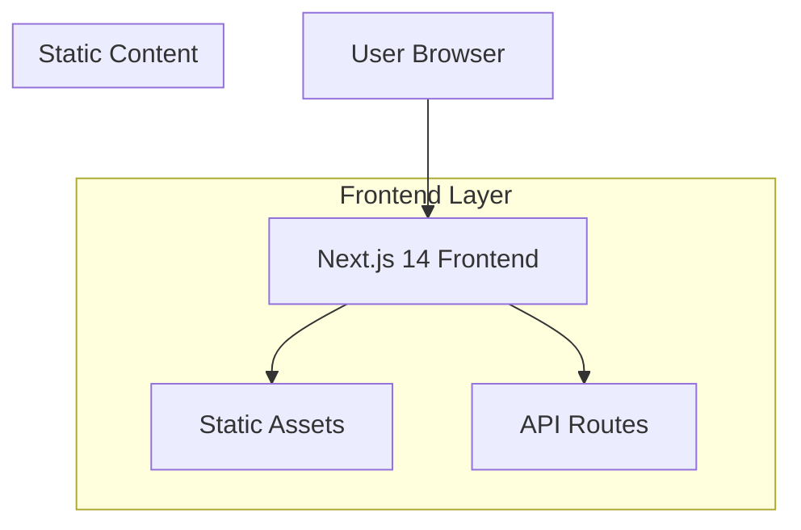

## 1. Architecture design



## 2. Technology Description
- **Frontend**: Next.js 14 + React 18 + TypeScript
- **Styling**: Tailwind CSS 3
- **Initialization Tool**: create-next-app
- **Backend**: None (静态网站生成)
- **部署**: 支持静态导出，可部署到Vercel、Netlify等平台

## 3. Route definitions
| Route | Purpose |
|-------|---------|
| / | 首页，展示个人简介和核心信息 |
| /about | 关于我页面，详细介绍个人背景 |
| /skills | 技能页面，展示技术栈和能力 |
| /projects | 作品展示页面，项目列表和详情 |
| /contact | 联系方式页面，联系表单和社交链接 |

## 4. Component Architecture
### 4.1 核心组件结构
```
src/
├── components/
│   ├── layout/
│   │   ├── Header.tsx          # 顶部导航栏
│   │   ├── Footer.tsx          # 底部信息
│   │   └── Layout.tsx          # 页面布局容器
│   ├── home/
│   │   ├── HeroSection.tsx     # Hero区域
│   │   ├── SkillsOverview.tsx  # 技能概览
│   │   └── FeaturedProjects.tsx # 精选作品
│   ├── about/
│   │   ├── PersonalIntro.tsx   # 个人简介
│   │   ├── Education.tsx       # 教育经历
│   │   └── Experience.tsx      # 工作经历
│   ├── skills/
│   │   ├── SkillCategory.tsx   # 技能分类
│   │   └── SkillItem.tsx       # 单项技能
│   ├── projects/
│   │   ├── ProjectGrid.tsx     # 项目网格
│   │   ├── ProjectCard.tsx     # 项目卡片
│   │   └── ProjectModal.tsx    # 项目详情模态框
│   └── contact/
│       ├── ContactForm.tsx     # 联系表单
│       └── SocialLinks.tsx     # 社交链接
├── pages/
│   ├── index.tsx               # 首页
│   ├── about.tsx               # 关于我
│   ├── skills.tsx              # 技能
│   ├── projects.tsx            # 作品
│   └── contact.tsx             # 联系
├── styles/
│   └── globals.css             # 全局样式
├── data/
│   ├── projects.json           # 项目数据
│   ├── skills.json             # 技能数据
│   └── personal.json           # 个人信息
└── utils/
    ├── animations.ts           # 动画工具
    └── types.ts                # TypeScript类型定义
```

### 4.2 数据管理
- 使用JSON文件存储静态数据（项目、技能、个人信息）
- 通过getStaticProps在构建时获取数据
- 支持增量静态再生(ISR)以更新内容

### 4.3 性能优化
- 使用Next.js Image组件优化图片加载
- 实现代码分割和懒加载
- 使用Tailwind CSS的Purge功能优化CSS体积
- 启用静态生成和CDN缓存

### 4.4 SEO优化
- 使用Next.js Head组件管理页面元数据
- 实现Open Graph标签支持社交媒体分享
- 添加结构化数据(JSON-LD)提升搜索引擎理解
- 生成sitemap.xml和robots.txt

### 4.5 无障碍访问
- 使用语义化HTML标签
- 确保键盘导航支持
- 添加ARIA标签提升屏幕阅读器体验
- 保持足够的颜色对比度

## 5. 部署配置
### 5.1 构建配置
```json
{
  "scripts": {
    "dev": "next dev",
    "build": "next build",
    "export": "next export",
    "start": "next start",
    "lint": "next lint"
  }
}
```

### 5.2 环境变量
```env
NEXT_PUBLIC_SITE_URL=https://aoki-portfolio.com
NEXT_PUBLIC_GITHUB_URL=https://github.com/aoki
NEXT_PUBLIC_LINKEDIN_URL=https://linkedin.com/in/aoki
NEXT_PUBLIC_EMAIL=contact@aoki.com
```

### 5.3 部署平台
- **Vercel**: 原生支持Next.js，自动部署
- **Netlify**: 支持静态导出，拖拽部署
- **GitHub Pages**: 免费托管，适合个人项目